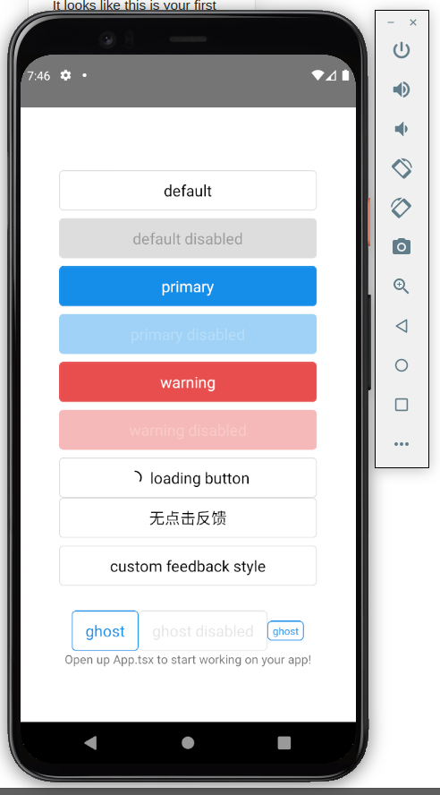
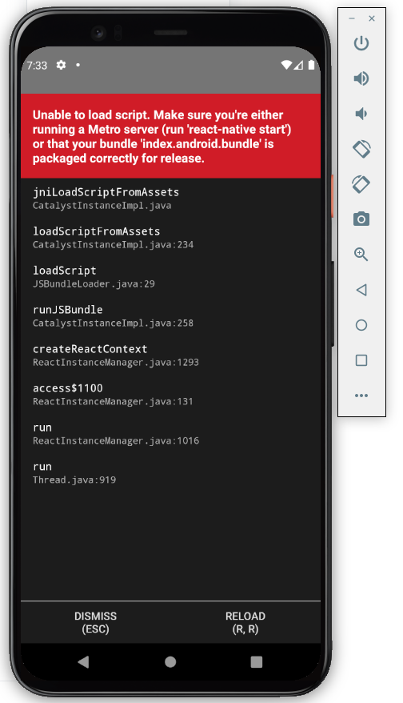

# poc-expo-ant-fireauth

## Demo web

Web demo: [https://poc-expo-ant-fireauth.web.app/](https://poc-expo-ant-fireauth.web.app/)

## Demo Android



## To Do

- [x] Add [REACT NATIVE FIREBASE](https://rnfirebase.io/)
  - [x] Users can create account using a phone number
  - [x] users can create account using an email and password
  - [x] users can create account using their google account
  - [ ] users can create account using their facebook account
  - [ ] users can create account using their apple account

- [ ] Add [expo github action](https://github.com/expo/expo-github-action)

## Bugs

Error:

```text
Unable to load script. Make sure you're either running a Metro serve (run 'react-native start') or that your bundle 'index.android.bundle' is packaged correctly for release.
```



### Steps to fix

In one terminal run:

**1)** `yarn start`

**2)** `press r`  **To reload the app press "r"**

In other terminal run:

**3)** `yarn android --verbose`

## How to Generate a React Native Release Build APK for Android

https://www.instamobile.io/android-development/generate-react-native-release-build-android/
